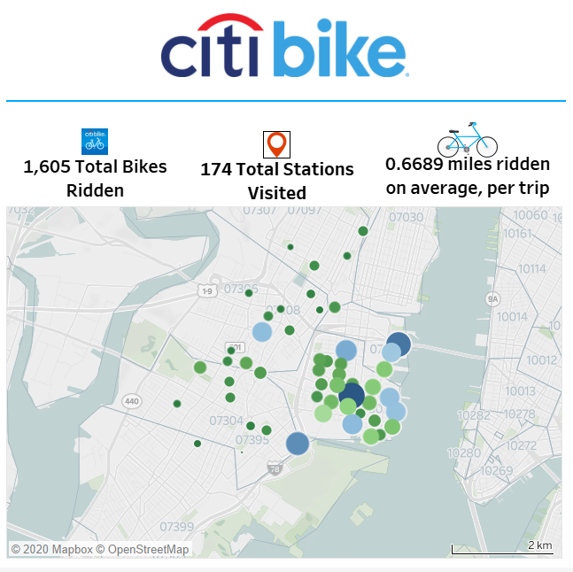
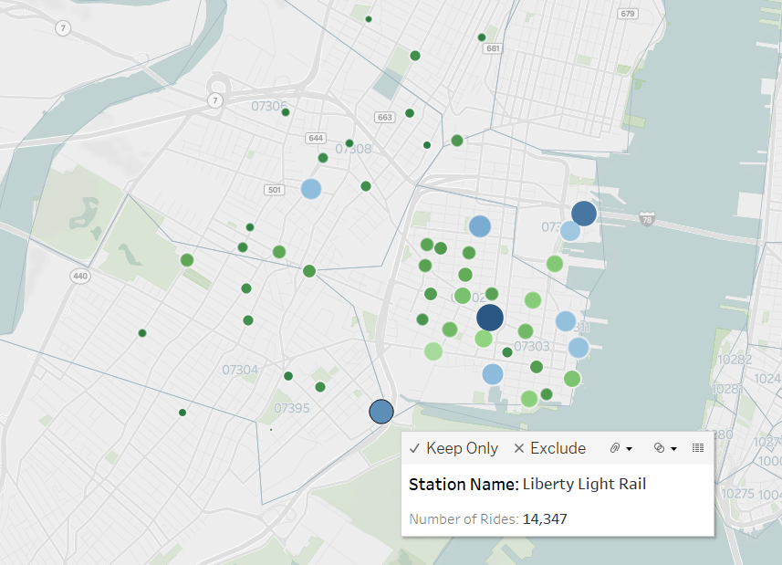
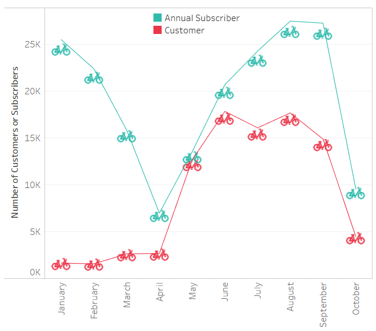
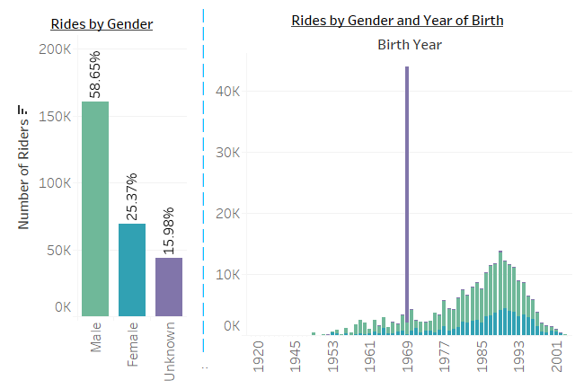
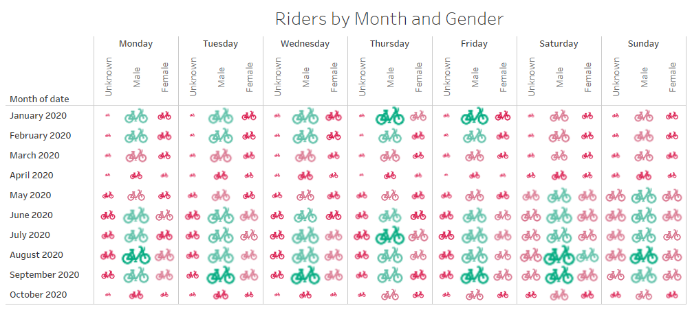
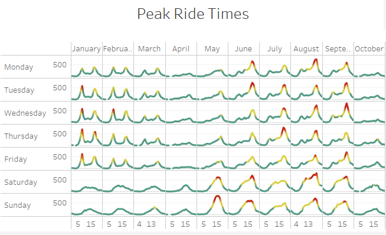

# Citi Bike Analytics - Kirstie McCown - 22/10/2020

 

Welcome to my project repo! 
You can visit the website [here](https://public.tableau.com/profile/kirstie.mccown#!/vizhome/CitiBikeAnalytics_16033062604990/CitiBikeAnalysisJanuary-October2020), or feel free to take a look around the repo folders! 
When you visit the website, you will find an interactive Tableau Story where you can observe information about Citi Bike in New York City!

If you are interested, you can find out more information about the Citi Bike data used for this project here: [Citi Bike Data](https://www.citibikenyc.com/system-data)
 
 
## About the Tableau Story - My Analysis

 

Citi Bike currently has 14,500 bikes and 950 stations across Manhattan, Brooklyn, Queens and Jersey City. Designed for quick trips with convenience in mind, we have analysed data from January to September 2020.

There is a clear trend showing in some of the top performing stations in NYC - this being that the top 5 Start Stations, are also the top 5 End Stations for rides, along with 1 of those being the top performing station for longest average trip duration! Why? Possibly for a couple of reasons, Liberty Light Rail is slightly further away from most of the other stations, therefore will always be a top performer for longest average trip duration as users have to travel futher to get to their destination. 
Potentially, users might also be utilising Liberty Light Rail to head in the opposite direction to all other stations, hence why users tend to start and return to this same station.

 

Individuals using the Citi Bike service are broken down into two types of users. Annual Subscribers; or Customers, who purchase either a 24 hour or 3 day pass. 
Interestingly enough, there is a large decline in the number of Annual Subscribers up until April 2020 - likely linked to COVID 19, whist Customers increased slightly in this period. From April to June both Annual Subscribers and Customers increased to well above their pre-covid numbers, but have since declined - again likely linked to another COVID 19 outbreak.

 

There has been an interesting change in the number of female riders over the last 10 months, where again it follows a similar pattern to that of all riders during the period of April to October. Likewise the same general trend is seen that Male riders are the majority of users of Citi Bike, regardless of age. 
The highest number of users seen to be utilising the service are those from around 1985 to 1995 (25 to 35 years of age), although we can see that users span between the ages of approximately 16 to 70. There is also some data that may potentially be irrelevant to calculations, which is riders of an Unknown gender, from 1969 who make up over 15% of the riders from that year group or a total of almost 42,000 riders. 
I feel this has been data that is captured incorrectly, or not entered truthfully by the rider and therefore null and void. 

 

Continuting on the general trend that males are the majority users of Citi Bike, we wanted to determine if there were any specific days or times that would also have an impact on rides. Overall, Males are still the highest percentage users, regardless of time or date. What we can also see is that we have peak times of travel, both relating to more use in the Summer months, and also at different times during Summer. These times generally correlate to work commute times, particuarly in the evenings; and then a similar trend in Winter between Monday to Friday, although number of rides does drop off significantly during this time.

 
 

 

### Created With
This project was created using the following: 
* Excel (CSV)
* Tableau Public

